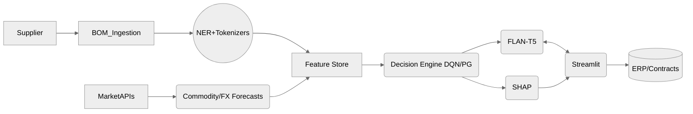

# AI-Driven Intelligent Negotiation Framework for Apparel & Accessories

## Overview
The Intelligent Negotiation Framework automates apparel & accessories (A&A) sourcing workflows. It parses bills of materials (BOMs), enriches context with market and historical intelligence, and guides buyers through explainable, human-in-the-loop negotiations powered by reinforcement learning and large language models.

### Feature Map
- **FastAPI Service** with REST endpoints for BOM parsing, market signals, and negotiation orchestration.
- **BOM Intelligence** pipeline combining deterministic parsing, regex-augmented NER, and graph similarity insights.
- **Negotiation Copilot** leveraging FLAN-T5 prompt templates with a safe rule-based fallback for offline demos.
- **Decision Engine** featuring DQN/Policy Gradient-inspired heuristics, supplier simulation, and buyer approval hooks.
- **Explainability Layer** generating SHAP-style feature attributions for every counter-offer.
- **Governance & Observability** including PII redaction, drift checks, and red-team prompt guardrails.
- **Streamlit Buyer Dashboard** showcasing negotiations, BOM parsing, market benchmarks, and explainability outputs.

### Architecture


### Repository Layout
```
.
├─ README.md
├─ LICENSE
├─ CONTRIBUTING.md
├─ CHANGELOG.md
├─ Makefile
├─ docker-compose.yml
├─ Dockerfile
├─ pyproject.toml
├─ .pre-commit-config.yaml
├─ .gitignore
├─ .env.example
├─ config/
│  ├─ settings.yaml
│  ├─ logging.yaml
│  └─ prompts/
│     ├─ system_prompt.txt
│     ├─ negotiation_prompt.txt
│     └─ red_team_checks.md
├─ data/
│  ├─ sample_boms/
│  │  ├─ bom_001.xlsx
│  │  ├─ bom_002.csv
│  │  └─ bom_003.pdf
│  ├─ market_signals/
│  │  ├─ commodity_prices.csv
│  │  └─ fx_rates.csv
│  └─ historical_negotiations/
│     └─ transcripts.jsonl
├─ docs/
│  ├─ ARCHITECTURE.md
│  ├─ GOVERNANCE.md
│  ├─ SECURITY.md
│  ├─ DATA_DICTIONARY.md
│  ├─ METRICS.md
│  └─ diagrams/
│     ├─ system_diagram.mmd
│     └─ data_pipeline.mmd
├─ openapi/
│  └─ spec.yaml
├─ src/
│  ├─ app/
│  │  ├─ main.py
│  │  ├─ api/
│  │  │  ├─ routes_negotiation.py
│  │  │  ├─ routes_bom.py
│  │  │  ├─ routes_market.py
│  │  │  └─ routes_health.py
│  │  ├─ services/
│  │  │  ├─ chatbot.py
│  │  │  ├─ bom_parser.py
│  │  │  ├─ ner_pipeline.py
│  │  │  ├─ graph_similarity.py
│  │  │  ├─ market_signals.py
│  │  │  ├─ rl_agent.py
│  │  │  ├─ explainability.py
│  │  │  └─ governance.py
│  │  ├─ adapters/
│  │  │  ├─ erp_adapter.py
│  │  │  └─ data_store.py
│  │  └─ utils/
│  │     ├─ config.py
│  │     ├─ logger.py
│  │     └─ schemas.py
│  ├─ cli/
│  │  ├─ ingest_boms.py
│  │  ├─ train_ner.py
│  │  ├─ train_rl.py
│  │  └─ forecast_market.py
│  └─ ui/
│     └─ streamlit_app.py
├─ tests/
│  ├─ test_api.py
│  ├─ test_bom_parser.py
│  ├─ test_ner_pipeline.py
│  ├─ test_graph_similarity.py
│  ├─ test_market_signals.py
│  ├─ test_rl_agent.py
│  └─ test_explainability.py
└─ scripts/
   ├─ bootstrap_demo.sh
   └─ seed_demo_data.py
```

## Quickstart
### Prerequisites
- Python 3.10+
- Git, Make
- Docker (optional)
- Node.js (optional, for UI customization)
- GPU (optional, for accelerated model fine-tuning)

### Local Setup (no GPU required)
1. Install Python 3.10+
2. `make setup` – installs dependencies via Poetry and configures pre-commit
3. `make seed` – seeds the demo SQLite database and feature store
4. `make dev` – starts FastAPI at http://localhost:8000 and Streamlit at http://localhost:8501
5. Visit http://localhost:8000/docs for API docs and http://localhost:8501 for the dashboard

### Docker Workflow
1. `docker compose up --build`
2. Access the API at http://localhost:8000 and the UI at http://localhost:8501

### Additional Commands
- `make api` – run only the FastAPI service with hot reload
- `make ui` – run only the Streamlit dashboard
- `make test` – run pytest with coverage
- `make lint` – run ruff lint checks
- `make format` – apply isort and black formatting
- `poetry run pre-commit run -a` – enforce formatting and linting across the repo

## Configuration
- `config/settings.yaml` centralizes app, model, RL, market, data, UI, and governance settings.
- `config/prompts/` stores system and negotiation prompt templates alongside red-team guardrails.
- `config/logging.yaml` defines structured logging for local development.

## Data & Artifacts
- Demo BOMs (`data/sample_boms`) include CSV/XLSX placeholders and a PDF note for future extraction.
- Market benchmarks and FX rates (`data/market_signals`) power the forecasting stub.
- Historical negotiation transcripts (`data/historical_negotiations`) feed the graph similarity demo.
- CLI scripts under `src/cli/` produce `.artifacts/` outputs for forecasts, NER, and RL simulations.

## Models & Intelligence
- **LLM**: Defaults to `google/flan-t5-small` with a tiny fallback; offline demos use a rule-based response.
- **NER**: Regex-enhanced entity extraction with a Hugging Face pipeline fallback.
- **Graph Similarity**: NetworkX-based heuristics to surface comparable suppliers/products.
- **RL Policies**: Heuristic DQN/Policy Gradient blend with simulated supplier environment and buyer approval hook.
- **Explainability**: Deterministic SHAP-style decomposition for UI visualizations.

## Governance & Security
- PII redaction, prompt guardrails, and drift monitoring implemented in `src/app/services/governance.py`.
- Detailed policies documented in `docs/GOVERNANCE.md`, `docs/SECURITY.md`, and `docs/METRICS.md`.
- Human-in-the-loop approvals via `buyer_approval` allow manual intervention.

## OpenAPI & Integrations
- FastAPI serves `/docs` using the static specification located at `openapi/spec.yaml`.
- ERP and data store adapters are defined in `src/app/adapters/`, ready to be swapped for production systems.

## Testing & Quality
- Run `make test` or `poetry run pytest -q` for unit tests.
- Coverage configuration targets ≥70% over `src/` (UI excluded).
- Pre-commit hooks enforce linting, formatting, and merge conflict checks.

## Troubleshooting
| Issue | Resolution |
| --- | --- |
| FastAPI fails to start | Ensure `.env` is configured and `make setup` completed without errors. |
| Streamlit cannot reach API | Update `config/settings.yaml` (`ui.api_url`) to match deployment host/port. |
| Missing Hugging Face models | Set `ENABLE_LLM=1` to attempt downloads or rely on built-in rule-based fallback. |
| SQLite permission errors | Verify the `data/` directory is writable; rerun `make seed`. |
| Docker build slow | Pre-build Poetry cache locally or adjust Dockerfile to use multi-stage builds. |

## Further Reading
- `docs/ARCHITECTURE.md` – deep dive into components and deployment modes
- `docs/DATA_DICTIONARY.md` – schema definitions for datasets and feature store
- `docs/METRICS.md` – KPIs and model health monitoring
- `docs/diagrams/` – Mermaid diagrams for systems and pipelines

Happy negotiating!
