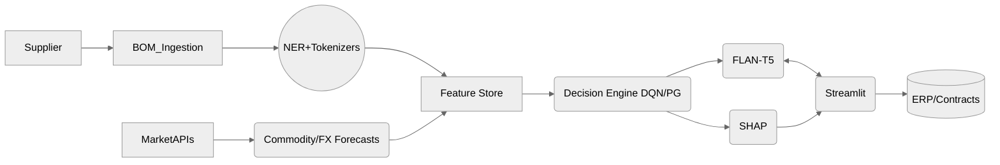

# Architecture Overview

The AI-Driven Intelligent Negotiation Framework orchestrates modular services that ingest bills of materials (BOMs), enrich them with entity recognition and similarity insights, and drive adaptive negotiation strategies through reinforcement learning.

## Key Components

- **FastAPI Service**: Hosts negotiation, BOM parsing, and market signal endpoints with OpenAPI documentation.
- **BOM Intelligence**: Combines deterministic parsing, rule-augmented NER, and graph similarity to contextualize sourcing scenarios.
- **Negotiation Copilot**: Wraps a configurable FLAN-T5 model with prompt templates, safety checks, and session memory.
- **Decision Engine**: Provides DQN and policy gradient policies with a simulated supplier environment and buyer approval hooks.
- **Explainability Layer**: Uses SHAP on surrogate models to expose the drivers of counter-offers for human review.
- **Market Signals**: Loads benchmark datasets and produces short-term forecasts for commodity and FX trends.
- **UI & Integrations**: Streamlit dashboard and ERP/data adapters demonstrate downstream consumption.

## Data Flow

## Deployment Modes

- **Local Dev**: `make dev` spawns FastAPI (port 8000) and Streamlit (port 8501).
- **Docker**: `docker compose up --build` for reproducible environments.
- **CI/CD**: GitHub Actions stub ensures linting, tests, and container builds.

## Extensibility

- Replace SQLite/DuckDB with cloud databases by editing `src/app/adapters/data_store.py`.
- Plug alternative LLMs by modifying model names in `config/settings.yaml`.
- Extend RL policies or integrate with production tracking via the optional `mlflow` extra.
